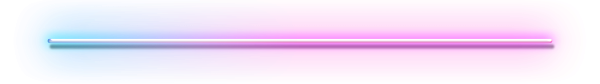

 <!--nginx-->
 <!--TF-->
 <!--Jupyter-->
 <!--Linux-->
 <!--Git-->

 

I'm the architect of my own digital realm, crafting it block by block as a frontend developer and software engineer. Each piece of code I write is a cornerstone, a foundation on which I build my knowledge. Currently, I'm donning my backend developer hat for the startup project "Rit" but my love for frontend development still takes center stage. Hackathons are my playground, and with my trusty team "Шампиньоны" we dive into the challenges headfirst. Meanwhile, I'm constantly leveling up my skills through courses, because in this ever-evolving tech landscape, there's always a new summit to conquer.

&nbsp;&nbsp; &nbsp; <b>Django</b> 
&nbsp;&nbsp; &nbsp; <b>ASP.NET</b>
&nbsp;&nbsp; &nbsp; <b>React</b>
&nbsp;&nbsp; &nbsp; <b>Next js</b>
 
&nbsp;&nbsp; &nbsp; <b>Type Script</b>
&nbsp;&nbsp; &nbsp; <b>Redux</b>
&nbsp;&nbsp; &nbsp; <b>Type Script</b>
&nbsp;&nbsp; &nbsp; <b>Tailwind</b>

